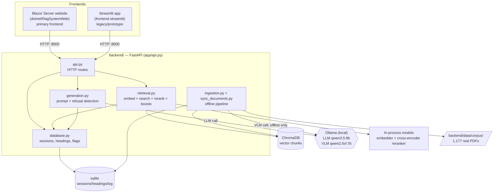
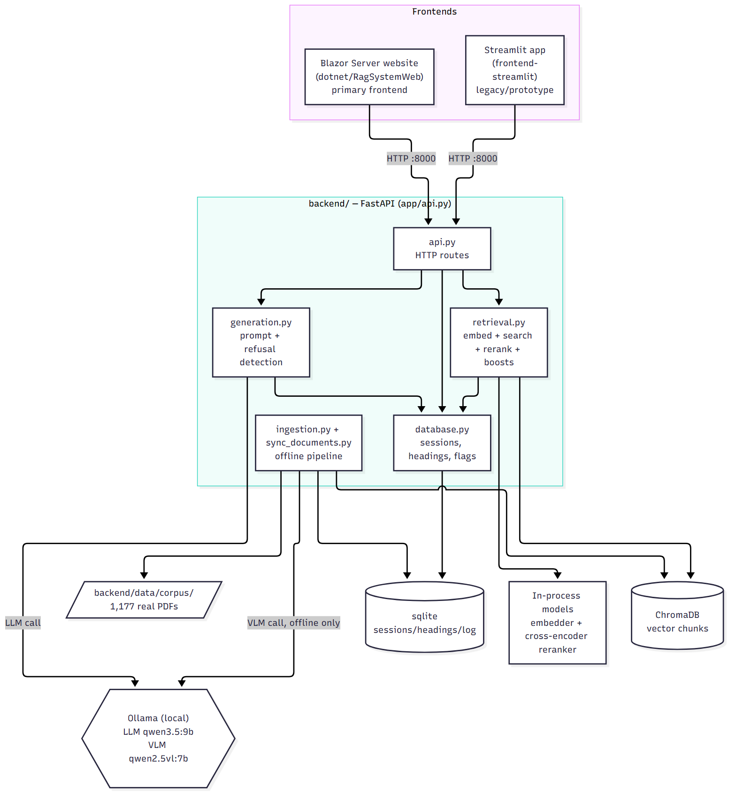
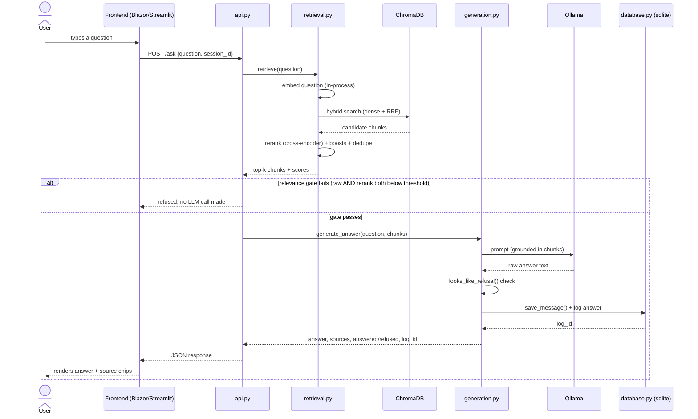
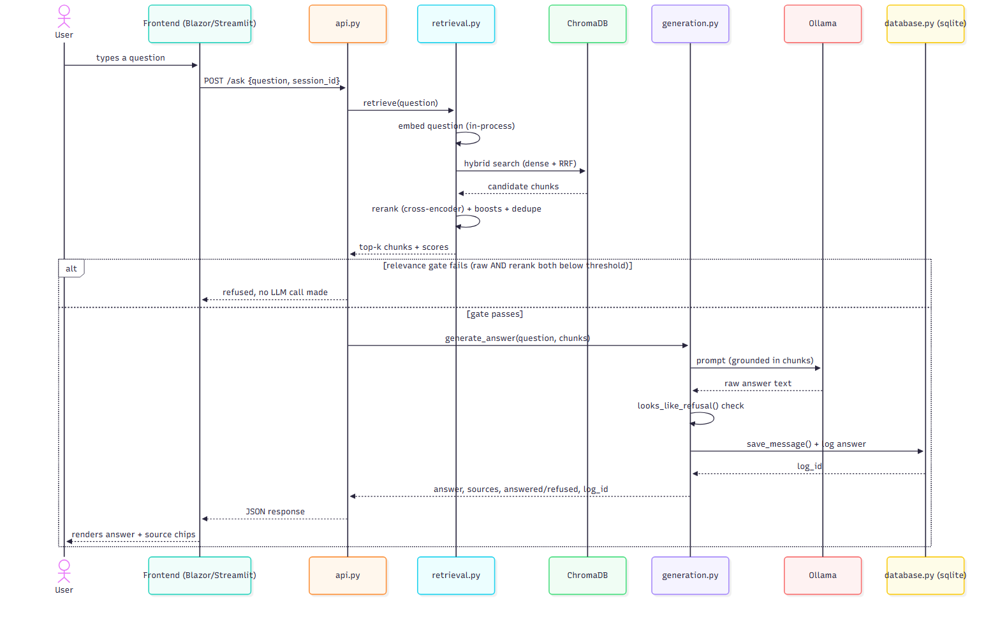
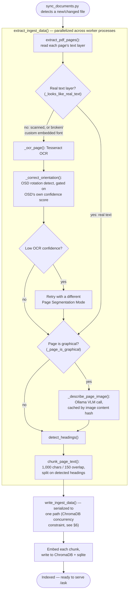
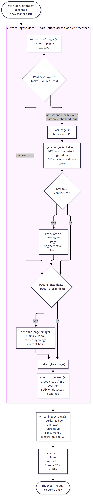
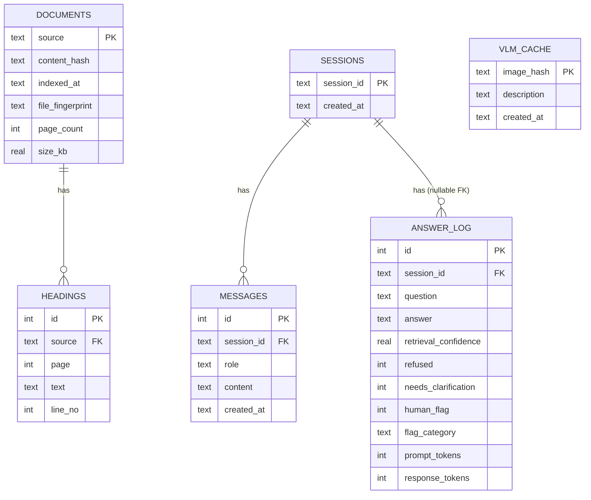
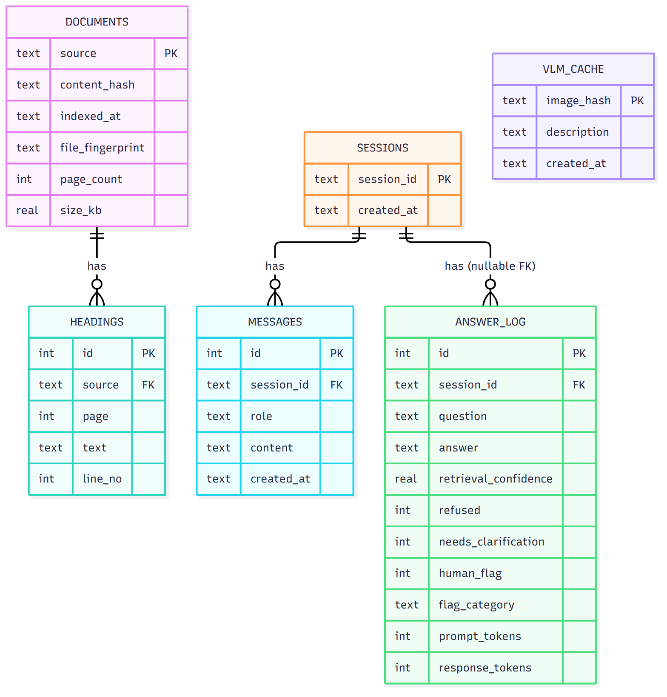
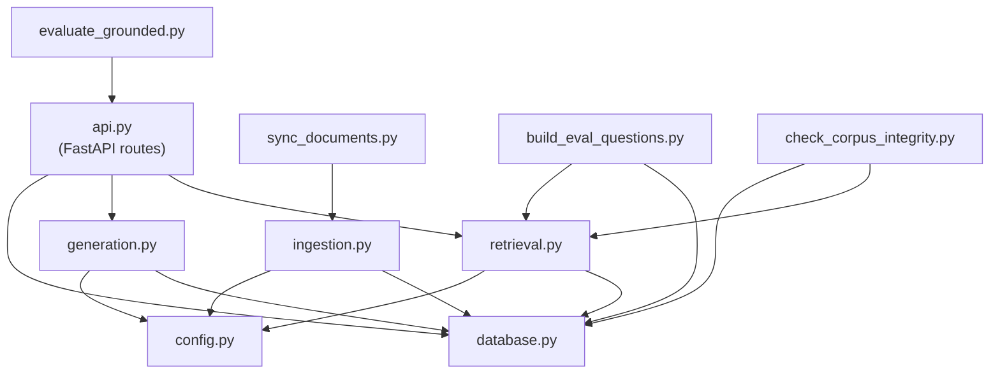
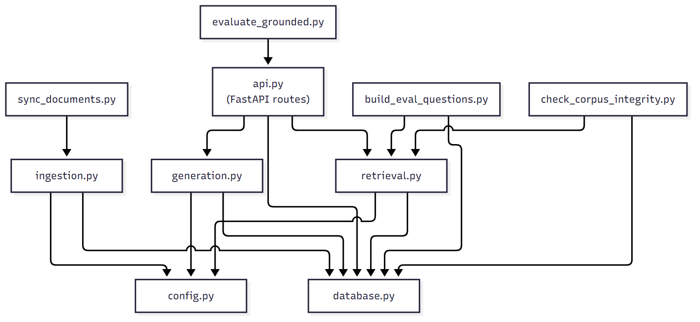

# STK Online — System Architecture

**Last updated:** 2026-10-01

This document exists so a new engineer can orient on this system without re-reading the whole codebase (see also [`NOTES.md`](NOTES.md) for project history and current state). It describes what exists and why, not implementation minutiae — read the module itself for that.

## 1. What this system is

A retrieval-augmented generation (RAG) question-answering system over 1,177 real internal documents (SOPs, contracts, TKO/TKI/TKPA procedures) for PT Pertamina Drilling Services Indonesia (PDSI). A user asks a question in Indonesian, the system retrieves relevant document chunks and answers grounded in them, or explicitly refuses when the corpus doesn't contain the answer. All documents are internal/confidential (real contracts, employee health data) — nothing in `backend/data/` goes to a third-party host; everything runs locally against a local Ollama instance.

**Two frontends exist** against the same backend contract — see [`README.md`](README.md) for which is which and current status of each.

## 2. Diagrams

### 2.1 Component overview

Both frontends are independent HTTP clients of the same backend; neither touches ChromaDB, sqlite, or Ollama directly.

*(The diagram above renders live on GitHub from the Mermaid code block; the PNG is a static backup for viewers that don't render Mermaid, e.g. local editors or exported PDFs.)*

### 2.2 Sequence: answering a question (`POST /ask`)

The exact flow narrated in §5 below, as a sequence diagram.

### 2.3 Ingestion pipeline (per page, inside `extract_ingest_data()`)

The branching logic behind most of the ingestion bugs in [`EVALUATION_RESULTS.md`](EVALUATION_RESULTS.md) §12 — real text vs. OCR fallback, rotation correction, and VLM diagram description are all decisions made per page, not a fixed per-document cost.

### 2.4 Database schema (sqlite, `backend/app/database.py`)

`VLM_CACHE` is standalone (keyed by image content hash, no relation to the other tables) — this is the caching layer referenced in §6's "VLM description caching" design decision. `ANSWER_LOG.session_id` is nullable: not every answer is tied to a chat session (e.g. direct API testing).

### 2.5 Module dependencies (`backend/app/`)

Matches the responsibilities table in §4 — arrows show "depends on / calls into."

## 3. High-level architecture

**Which module uses which model — the short version:**

| Module | Model(s) it calls | How |
|---|---|---|
| `retrieval.py` | Embedding model + reranker | Loaded in-process (sentence-transformers / cross-encoder) — **not** via Ollama, no network call |
| `generation.py` | LLM (`qwen3.5:9b`) | Via a local Ollama HTTP call |
| `ingestion.py` | VLM (`qwen2.5vl:7b`) | Via a local Ollama HTTP call — **only at ingest time**, never while answering a live question |

`database.py` (sqlite: sessions, headings, document registry, flags) is called
by both `retrieval.py` and `generation.py` along the way (see §2.1's diagram),
not detailed again here — see §4 for what it stores.

**Ingestion is a separate, offline pipeline** (`ingestion.py` +
`sync_documents.py`) — it runs before any question is ever asked, populating
ChromaDB and sqlite from `backend/data/corpus/`. It's the only place the VLM gets
called. The serving path (§2.2) never touches it at request time.

Two separate concerns, deliberately: **ingestion** (offline, run via `sync_documents`, populates ChromaDB + sqlite from `backend/data/corpus/`) and **serving** (the FastAPI app, read-only against the already-built index at request time). The UI never touches ChromaDB or sqlite directly — everything goes through the FastAPI HTTP API, which is exactly what let the .NET frontend get built later with zero backend changes.

## 4. Module responsibilities (`backend/app/`)

| Module | Responsibility |
|---|---|
| `api.py` | FastAPI routes: `/ask`, `/sync`, `/documents` (list/download), `/sessions`, `/sessions/{id}/history`, `/flag/{log_id}`, `/health`, `/monitor` (status page). Thin — delegates to `retrieval`/`generation`/`database`. |
| `config.py` | All tuning constants in one place (models, timeouts, thresholds, chunk sizes) with inline rationale comments explaining *why* each value is what it is. |
| `ingestion.py` | PDF parsing, OCR fallback (scanned/broken-font pages), rotation correction, VLM diagram description, structure-aware chunking, embedding, writing to ChromaDB + sqlite. The CPU-bound extraction half (`extract_ingest_data`) is separated from the shared-state-writing half (`write_ingest_data`) so extraction can be parallelized across worker processes while writes stay serialized. |
| `sync_documents.py` | Corpus reconciliation via content hashing: detects new/updated/unchanged/deleted files. One implementation, four trigger paths (scheduled job, `/sync` endpoint, UI button, manual CLI run). |
| `retrieval.py` | Embedding search + cross-encoder rerank + hybrid search (RRF) + several targeted boosts (exact identifier, own-document-code, heading-quote) + ambiguity detection + the relevance gate. All ChromaDB access is funneled through one dedicated thread (`run_on_chroma_thread`) since Chroma isn't safe for concurrent multi-thread access. |
| `generation.py` | Prompt construction, the Ollama call, multi-question splitting, refusal detection (`looks_like_refusal`), fabrication safety nets, the `ClarificationNeeded` response shape for ambiguous document references. |
| `database.py` | All sqlite access: chat sessions/history, headings index, document registry (content hash, page count, size — for `/documents`), VLM description cache, answer-flagging log. |
| `evaluate_grounded.py` | Checkpointed, resumable benchmark harness — runs `backend/data/eval_questions.json` against the live system, scores retrieval/behavioral/content metrics, writes `backend/data/eval_report.md`. See [`EVALUATION_RESULTS.md`](EVALUATION_RESULTS.md) for the latest numbers. |
| `build_eval_questions.py` | Generates eval questions from the *real* indexed corpus (ground truth always comes from what's actually stored, never hand-invented). |
| `check_corpus_integrity.py`, `test_extraction.py`, `reingest.py`, `reset_index.py`, `dump_chunks.py` | Operational/debug tooling — corpus anomaly auditing, extraction smoke tests, targeted re-ingestion, full index reset, chunk-log regeneration. |
| `test_units.py` | Unit tests for pure/isolated functions (no Chroma/sqlite/Ollama) — fast, safe to run anytime. |

## 5. Data flow: answering a question

See §2.2 for the sequence diagram — this is the same flow in prose, with the specific thresholds/config values that make each step concrete:

1. **UI → `/ask`** with `{question, session_id}`.
2. **`retrieval.retrieve()`**: embed the question, search ChromaDB (hybrid: dense + optionally sparse via RRF), rerank top candidates with a cross-encoder, apply boosts (exact identifier match, own-document-code, quoted-heading jump), dedupe repeated chunks (e.g. running headers), truncate to `TOP_K` (8).
3. **Relevance gate** (`_passes_relevance_gate`): if neither the raw similarity score nor the rerank score clears its threshold (`RELEVANCE_MIN_SCORE=0.62` raw, `RELEVANCE_MIN_RERANK_SCORE=0.0` rerank, OR'd — fails closed if rerank score is missing), refuse immediately without calling the LLM.
4. **`generation.generate_answer()`**: build a grounded prompt from the surviving chunks, call Ollama (`qwen3.5:9b`, `"think": false` — see NOTES.md for why), get an answer.
5. **`looks_like_refusal()`**: keyword pre-check, then (only if a keyword matched) semantic-similarity check against canonical refusal templates — decides whether this was actually a refusal even if the LLM didn't use an exact expected phrase.
6. **Response** includes the answer, source documents, an `answered`/`refused` flag, and a `log_id` for human flagging (`/flag/{log_id}`) if applicable.

Diagram/image-heavy pages get a VLM (`qwen2.5vl:7b`) description folded into their chunk text **at ingestion time**, not at answer time — the LLM never sees a raw image, only the pre-generated text description.

## 6. Key design decisions and why

- **Dual-signal relevance gate, not a single threshold.** Raw cosine similarity alone let some off-topic questions through; rerank score alone had its own gaps. OR-ing both, and failing closed when rerank is unavailable, kept false positives at 0.992 precision across the full 1,177-document corpus (see [`EVALUATION_RESULTS.md`](EVALUATION_RESULTS.md)).
- **All ChromaDB access serialized through one thread.** ChromaDB is not safe for concurrent access from multiple threads/processes. Every retrieval call and every `/documents` metadata query goes through `retrieval.run_on_chroma_thread()`. Two real production bugs came from code that bypassed this pattern.
- **VLM description caching, not just `temperature=0`.** The vision model is not fully deterministic even at temperature 0 (confirmed: likely GPU floating-point execution-order variance) — caching by content hash is what actually makes re-ingestion of unchanged files deterministic.
- **Ingestion split into a parallelizable extraction phase and a serialized write phase.** PDF/OCR/VLM work is CPU/network-bound and shares no state, so it fans out across worker processes; ChromaDB/sqlite writes stay on one path to respect the concurrency constraint above.
- **Precision over recall in the refusal decision.** The system would rather say "not found" than risk answering from content that isn't really there — a deliberate tradeoff for a compliance/contract document system, not an oversight.
- **UI talks to the backend over HTTP only, never touches Chroma/sqlite directly.** This is what let the .NET frontend get built as a pure client-swap, with zero backend changes beyond one `FileResponse` content-disposition fix for inline PDF preview.

## 7. Current model/tuning configuration (as of this doc)

| Setting | Value |
|---|---|
| LLM | `qwen3.5:9b` (Ollama, local), thinking mode disabled for latency |
| VLM (diagram description) | `qwen2.5vl:7b` |
| Embedding model | `paraphrase-multilingual-MiniLM-L12-v2` |
| Reranker | `cross-encoder/mmarco-mMiniLMv2-L12-H384-v1` (GPU-capable, ~470MB) |
| Retrieval top-k | 8 (after rerank of 35 candidates) |
| Chunk size / overlap | 1,000 chars / 150 chars |
| Relevance gate | raw ≥ 0.62 OR rerank ≥ 0.0, fails closed |
| Ollama context window | 16,384 tokens |

## 8. The backend API contract

Both frontends (Streamlit and the Blazor Server website) are pure HTTP clients of this contract — no endpoint has ever needed to change for a new frontend to consume it. Run it with `uvicorn app.api:app` from inside `backend/`. **Every route is defined in `backend/app/api.py`** — file:line below is where to go read or change one.

| Endpoint | File:line | What it does |
|---|---|---|
| `GET /health` | `backend/app/api.py:64` | `{status, model}` — used by both frontends' auto-launch logic to confirm the backend is up. |
| `POST /ask` | `backend/app/api.py:69` | `{question, session_id?}` → answer(s), sources, `answered`/`refused`/`needs_clarification` flags, a `log_id` per answer. The one endpoint that calls `retrieval.py` + `generation.py` (see §2.2). |
| `POST /sync` | `backend/app/api.py:97` | Triggers `sync_documents.sync_once()` — corpus reconciliation (new/changed/deleted files). |
| `GET /sources` | `backend/app/api.py:102` | Raw list of indexed source filenames (`retrieval.list_indexed_sources()`) — lighter-weight than `/documents` below. |
| `GET /documents` | `backend/app/api.py:118` | List of all indexed documents with type label, page count, size — what both frontends' sidebar/document list calls. |
| `GET /documents/{filename}/preview` | `backend/app/api.py:158` | First-page text snippet + a base64 PNG thumbnail (Streamlit only used this; the Blazor website's preview panel uses `/download` + a native `<iframe>` instead). |
| `GET /documents/{filename}/chunks` | `backend/app/api.py:188` | Live view of exactly what's currently indexed for a document — reads straight from ChromaDB on every call, debugging/QA tool, not used by either frontend's normal UI. |
| `GET /documents/{filename}/download` | `backend/app/api.py:217` | Raw PDF, `Content-Disposition: inline` (set specifically for the Blazor website's `<iframe>` preview panel — see `dotnet/README.md`). |
| `POST /flag/{log_id}` | `backend/app/api.py:228` | Human review flagging. `category`/`corrected_answer` are **query params, not a JSON body** — a real mistake both frontends' client code had to get right on purpose. |
| `GET /export_flags` | `backend/app/api.py:239` | Dumps every flagged answer — operational/review tool, not used by either frontend's normal UI. |
| `POST /sessions` | `backend/app/api.py:244` | Creates a new chat session, returns its `session_id`. |
| `GET /sessions` | `backend/app/api.py:252` | List of sessions, most-recent-first, with an auto title (first message) and token totals. |
| `GET /sessions/{id}/history` | `backend/app/api.py:260` | A session's saved messages (`role`/`content`/`created_at` only — no per-message sources or flag id, see `dotnet/README.md`'s known limitation note). |
| `GET /monitor/status`, `GET /monitor` | `backend/app/api.py:283`, `:368` | JSON and HTML status page respectively — checks Ollama reachability live, self-contained (no separate frontend). |

Every filename-taking route goes through `_validated_path()` (`backend/app/api.py:107`): the filename must already be one of `retrieval.list_indexed_sources()`, never a raw path lookup — this is what stops path traversal onto arbitrary local files.

See [`dotnet/README.md`](dotnet/README.md) for how the Blazor Server frontend specifically consumes this contract, including its own auto-launch logic for the backend.
