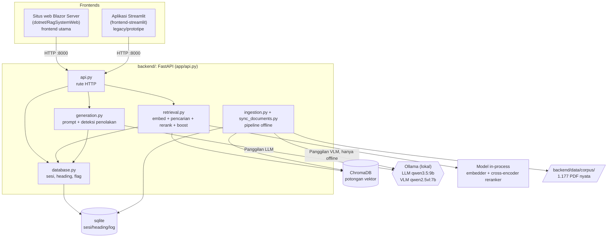
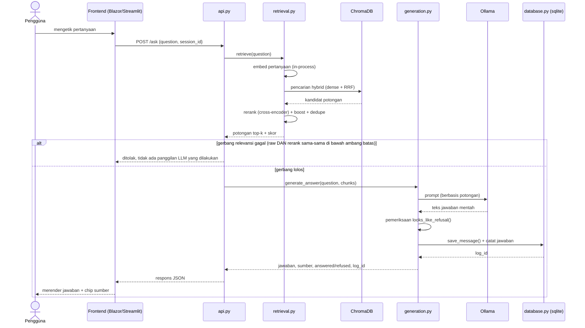
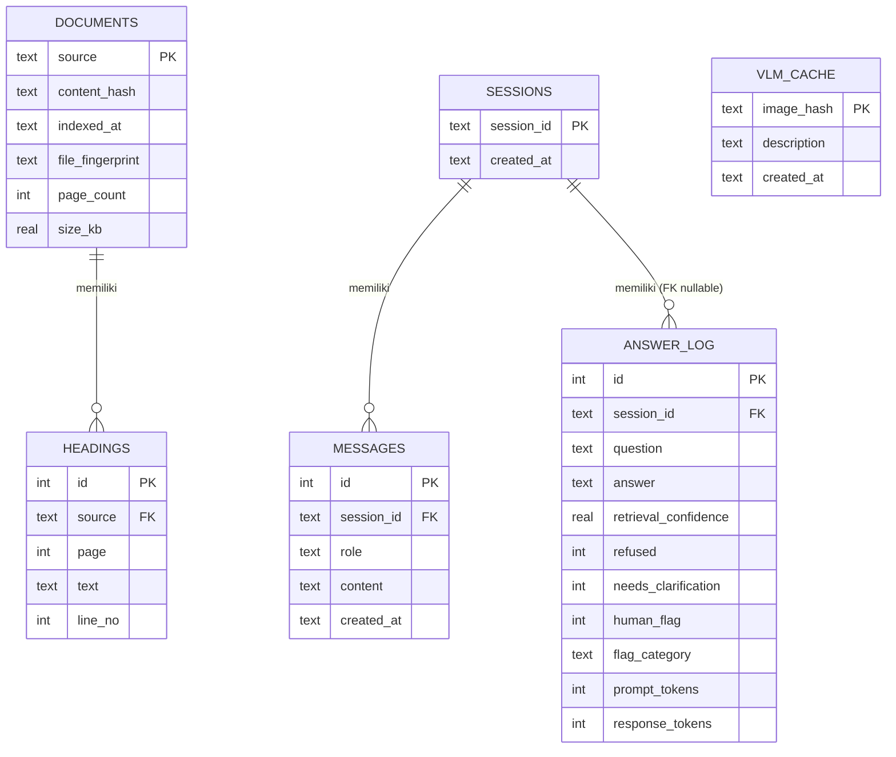
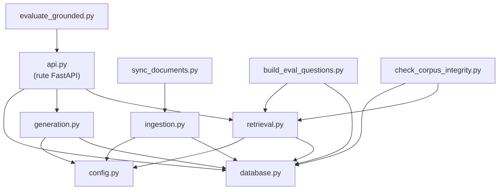

# STK Online: Arsitektur Sistem

**Terakhir diperbarui:** 2026-10-01

Dokumen ini dibuat agar seorang engineer baru dapat memahami sistem ini tanpa harus membaca ulang seluruh basis kode (lihat juga [`NOTES.md`](NOTES.md) untuk riwayat proyek dan status terkini). Dokumen ini menjelaskan apa yang ada dan alasannya, bukan detail implementasi; untuk itu, baca modulnya sendiri.

## 1. Apa sistem ini

Sebuah sistem tanya jawab retrieval-augmented generation (RAG) atas 1.177 dokumen internal nyata (SOP, kontrak, prosedur TKO/TKI/TKPA) untuk PT Pertamina Drilling Services Indonesia (PDSI). Pengguna mengajukan pertanyaan dalam Bahasa Indonesia, sistem mengambil potongan dokumen yang relevan dan menjawab berdasarkan potongan tersebut, atau menolak secara eksplisit ketika korpus tidak memuat jawabannya. Semua dokumen bersifat internal/rahasia (kontrak nyata, data kesehatan karyawan): tidak ada apa pun di `backend/data/` yang dikirim ke pihak ketiga; semuanya berjalan secara lokal terhadap instance Ollama lokal.

**Terdapat dua frontend** yang menggunakan kontrak backend yang sama, lihat [`README.md`](README.md) untuk mengetahui mana yang mana dan status terkini masing-masing.

## 2. Diagram

### 2.1 Gambaran umum komponen

Kedua frontend merupakan klien HTTP independen terhadap backend yang sama; keduanya tidak menyentuh ChromaDB, sqlite, atau Ollama secara langsung.

*(Diagram di atas dirender langsung di GitHub dari blok kode Mermaid; PNG merupakan cadangan statis untuk penampil yang tidak merender Mermaid, misalnya editor lokal atau PDF hasil ekspor.)*

### 2.2 Sekuens: menjawab sebuah pertanyaan (`POST /ask`)

Alur persis yang dijelaskan pada §5 di bawah, dalam bentuk diagram sekuens.

### 2.3 Pipeline ingestion (per halaman, di dalam `extract_ingest_data()`)

Logika percabangan di balik sebagian besar bug ingestion pada [`EVALUATION_RESULTS.md`](EVALUATION_RESULTS.md) §12: teks asli vs. fallback OCR, koreksi rotasi, dan deskripsi diagram VLM semuanya merupakan keputusan yang diambil per halaman, bukan biaya tetap per dokumen.

```mermaid
flowchart LR
    Trigger(["sync_documents.py mendeteksi file baru/berubah"]) --> PerPage

    subgraph PerPage["extract_ingest_data(): diparalelkan di beberapa worker process"]
        direction LR
        A["extract_pdf_pages():<br/>membaca lapisan teks setiap halaman"] --> B{"Lapisan teks<br/>asli?"}
        B -- "tidak: hasil pindai/font rusak" --> C["_ocr_page():<br/>Tesseract OCR"]
        C --> D["_correct_orientation():<br/>deteksi rotasi OSD"]
        D --> E{"Keyakinan OCR<br/>rendah?"}
        E -- "ya" --> F["Coba ulang dengan<br/>Page Segmentation Mode berbeda"]
        E -- "tidak" --> G{"Halaman bersifat<br/>grafis?"}
        F --> G
        B -- "ya: teks asli" --> G
        G -- "ya" --> H["_describe_page_image():<br/>panggilan VLM Ollama, di-cache<br/>berdasarkan hash konten gambar"]
        G -- "tidak" --> I["detect_headings()"]
        H --> I
        I --> J["chunk_page_text():<br/>1.000 karakter / overlap 150"]
    end

    J --> K["write_ingest_data():<br/>diserialisasi (konkurensi<br/>ChromaDB, lihat §6)"]
    K --> L["Embed setiap potongan,<br/>tulis ke ChromaDB + sqlite"]
    L --> Done(["Terindeks, siap<br/>melayani /ask"])
```

### 2.4 Skema basis data (sqlite, `backend/app/database.py`)

`VLM_CACHE` berdiri sendiri (menggunakan kunci hash konten gambar, tidak berelasi dengan tabel lain): ini adalah lapisan caching yang dirujuk pada keputusan desain "VLM description caching" di §6. `ANSWER_LOG.session_id` bersifat nullable: tidak setiap jawaban terikat pada sesi chat (misalnya pengujian API langsung).

### 2.5 Dependensi antar-modul (`backend/app/`)

Sesuai dengan tabel tanggung jawab pada §4; panah menunjukkan "bergantung pada / memanggil ke".

## 3. Arsitektur tingkat tinggi

**Modul mana yang menggunakan model yang mana, versi singkatnya:**

| Module | Model(s) it calls | How |
|---|---|---|
| `retrieval.py` | Model embedding + reranker | Dimuat in-process (sentence-transformers / cross-encoder): **bukan** melalui Ollama, tidak ada panggilan jaringan |
| `generation.py` | LLM (`qwen3.5:9b`) | Melalui panggilan HTTP Ollama lokal |
| `ingestion.py` | VLM (`qwen2.5vl:7b`) | Melalui panggilan HTTP Ollama lokal: **hanya pada saat ingest**, tidak pernah saat menjawab pertanyaan secara langsung |

`database.py` (sqlite: sesi, heading, registri dokumen, flag) dipanggil
oleh `retrieval.py` maupun `generation.py` di sepanjang alur (lihat diagram
§2.1), tidak dijelaskan lagi secara rinci di sini; lihat §4 untuk apa saja yang disimpannya.

**Ingestion merupakan pipeline terpisah yang berjalan secara offline**
(`ingestion.py` + `sync_documents.py`): berjalan sebelum ada pertanyaan apa
pun yang diajukan, mengisi ChromaDB dan sqlite dari `backend/data/corpus/`.
Ini adalah satu-satunya tempat VLM dipanggil. Alur serving (§2.2) tidak
pernah menyentuhnya pada saat request.

Dua concern yang sengaja dipisahkan: **ingestion** (offline, dijalankan lewat `sync_documents`, mengisi ChromaDB + sqlite dari `backend/data/corpus/`) dan **serving** (aplikasi FastAPI, bersifat read-only terhadap indeks yang sudah dibangun pada saat request). UI tidak pernah menyentuh ChromaDB atau sqlite secara langsung; semuanya melewati HTTP API FastAPI, yang justru memungkinkan frontend .NET dibangun belakangan tanpa perubahan apa pun pada backend.

## 4. Tanggung jawab modul (`backend/app/`)

| Module | Responsibility |
|---|---|
| `api.py` | Rute FastAPI: `/ask`, `/sync`, `/documents` (list/download), `/sessions`, `/sessions/{id}/history`, `/flag/{log_id}`, `/health`, `/monitor` (halaman status). Tipis: hanya mendelegasikan ke `retrieval`/`generation`/`database`. |
| `config.py` | Semua konstanta tuning dikumpulkan di satu tempat (model, timeout, ambang batas, ukuran chunk) dengan komentar inline yang menjelaskan *mengapa* setiap nilai ditetapkan seperti itu. |
| `ingestion.py` | Parsing PDF, fallback OCR (halaman hasil pindai/font rusak), koreksi rotasi, deskripsi diagram VLM, chunking yang sadar struktur, embedding, dan penulisan ke ChromaDB + sqlite. Bagian ekstraksi yang CPU-bound (`extract_ingest_data`) dipisahkan dari bagian penulisan shared-state (`write_ingest_data`) sehingga ekstraksi dapat diparalelkan di beberapa worker process sementara penulisan tetap diserialisasi. |
| `sync_documents.py` | Rekonsiliasi korpus melalui content hashing: mendeteksi file baru/diperbarui/tidak berubah/dihapus. Satu implementasi, empat jalur pemicu (scheduled job, endpoint `/sync`, tombol UI, menjalankan CLI secara manual). |
| `retrieval.py` | Pencarian embedding + rerank cross-encoder + pencarian hybrid (RRF) + beberapa boost yang ditargetkan (identifier persis, kode dokumen sendiri, kutipan heading) + deteksi ambiguitas + gerbang relevansi. Semua akses ChromaDB disalurkan melalui satu thread khusus (`run_on_chroma_thread`) karena Chroma tidak aman untuk akses multi-thread secara konkuren. |
| `generation.py` | Konstruksi prompt, panggilan Ollama, pemisahan multi-pertanyaan, deteksi penolakan (`looks_like_refusal`), jaring pengaman fabrikasi, bentuk respons `ClarificationNeeded` untuk referensi dokumen yang ambigu. |
| `database.py` | Semua akses sqlite: sesi/riwayat chat, indeks heading, registri dokumen (content hash, jumlah halaman, ukuran, untuk `/documents`), cache deskripsi VLM, log penandaan jawaban. |
| `evaluate_grounded.py`* | Harness benchmark yang di-checkpoint dan dapat dilanjutkan (resumable): menjalankan `backend/data/eval_questions.json` terhadap sistem live, menilai metrik retrieval/behavioral/content, dan menulis `backend/data/eval_report.md`. Lihat [`EVALUATION_RESULTS.md`](EVALUATION_RESULTS.md) untuk angka terbaru. |
| `build_eval_questions.py`* | Menghasilkan pertanyaan evaluasi dari korpus yang *benar-benar* terindeks (ground truth selalu berasal dari apa yang benar-benar tersimpan, tidak pernah dikarang manual). |
| `check_corpus_integrity.py`*, `test_extraction.py`*, `reingest.py`*, `reset_index.py`*, `dump_chunks.py`* | Tooling operasional/debug: audit anomali korpus, smoke test ekstraksi, re-ingestion yang ditargetkan, reset indeks penuh, regenerasi chunk-log. |
| `test_units.py`* | Unit test untuk fungsi murni/terisolasi (tanpa Chroma/sqlite/Ollama): cepat, aman dijalankan kapan saja. |

*Tooling test/eval/maintenance, tidak diperlukan untuk menjalankan aplikasi itu sendiri: disimpan lokal saja (gitignored), dengan alasan yang sama seperti `backend/testing/` di `.gitignore`. Tidak ada di repo GitHub ini; tanyakan ke pemilik repo jika membutuhkannya.

## 5. Alur data: menjawab sebuah pertanyaan

Lihat §2.2 untuk diagram sekuensnya; ini adalah alur yang sama dalam bentuk naratif, dengan nilai ambang batas/konfigurasi spesifik yang membuat setiap langkah konkret:

1. **UI → `/ask`** dengan `{question, session_id}`.
2. **`retrieval.retrieve()`**: embed pertanyaan, cari di ChromaDB (hybrid: dense + opsional sparse via RRF), rerank kandidat teratas dengan cross-encoder, terapkan boost (kecocokan identifier persis, kode dokumen sendiri, lompatan heading yang dikutip), dedupe potongan yang berulang (misalnya running header), potong hingga `TOP_K` (8).
3. **Gerbang relevansi** (`_passes_relevance_gate`): jika baik skor kemiripan mentah maupun skor rerank sama-sama tidak melewati ambang batasnya (`RELEVANCE_MIN_SCORE=0.62` untuk raw, `RELEVANCE_MIN_RERANK_SCORE=0.0` untuk rerank, digabung dengan OR; gagal secara tertutup jika skor rerank tidak tersedia), tolak langsung tanpa memanggil LLM.
4. **`generation.generate_answer()`**: bangun prompt yang berbasis pada potongan yang lolos, panggil Ollama (`qwen3.5:9b`, `"think": false`; lihat NOTES.md untuk alasannya), dapatkan jawaban.
5. **`looks_like_refusal()`**: pre-check berbasis kata kunci, kemudian (hanya jika ada kata kunci yang cocok) pemeriksaan kemiripan semantik terhadap template penolakan kanonis; menentukan apakah ini sebenarnya penolakan meskipun LLM tidak menggunakan frasa persis yang diharapkan.
6. **Respons** mencakup jawaban, dokumen sumber, flag `answered`/`refused`, dan `log_id` untuk penandaan oleh manusia (`/flag/{log_id}`) jika berlaku.

Halaman yang padat diagram/gambar mendapat deskripsi VLM (`qwen2.5vl:7b`) yang digabungkan ke dalam teks potongannya **pada saat ingestion**, bukan pada saat menjawab; LLM tidak pernah melihat gambar mentah, hanya deskripsi teks yang telah dibuat sebelumnya.

## 6. Keputusan desain utama dan alasannya

- **Gerbang relevansi dua sinyal, bukan ambang batas tunggal.** Kemiripan kosinus mentah saja meloloskan beberapa pertanyaan di luar topik; skor rerank saja juga punya celah sendiri. Menggabungkan keduanya dengan OR, dan gagal tertutup saat rerank tidak tersedia, menjaga false positive pada presisi 0,992 di seluruh korpus 1.177 dokumen (lihat [`EVALUATION_RESULTS.md`](EVALUATION_RESULTS.md)).
- **Semua akses ChromaDB diserialisasi lewat satu thread.** ChromaDB tidak aman untuk akses konkuren dari beberapa thread/proses. Setiap panggilan retrieval dan setiap query metadata `/documents` melewati `retrieval.run_on_chroma_thread()`. Dua bug produksi nyata muncul dari kode yang melewati pola ini.
- **Caching deskripsi VLM, bukan sekadar `temperature=0`.** Model vision tidak sepenuhnya deterministik bahkan pada temperature 0 (telah dikonfirmasi: kemungkinan karena variasi urutan eksekusi floating-point pada GPU); caching berdasarkan content hash adalah yang sebenarnya membuat re-ingestion file yang tidak berubah menjadi deterministik.
- **Ingestion dipecah menjadi fase ekstraksi yang dapat diparalelkan dan fase penulisan yang diserialisasi.** Pekerjaan PDF/OCR/VLM bersifat CPU/network-bound dan tidak berbagi state, sehingga dapat disebar ke beberapa worker process; penulisan ChromaDB/sqlite tetap berada pada satu jalur untuk menghormati batasan konkurensi di atas.
- **Presisi lebih diutamakan daripada recall dalam keputusan penolakan.** Sistem lebih memilih mengatakan "tidak ditemukan" daripada mengambil risiko menjawab dari konten yang sebenarnya tidak ada; ini adalah tradeoff yang disengaja untuk sistem dokumen compliance/kontrak, bukan kelalaian.
- **UI berkomunikasi dengan backend hanya lewat HTTP, tidak pernah menyentuh Chroma/sqlite secara langsung.** Inilah yang memungkinkan frontend .NET dibangun sebagai penggantian klien murni, tanpa perubahan backend apa pun selain satu perbaikan content-disposition pada `FileResponse` untuk preview PDF inline.

## 7. Konfigurasi model/tuning saat ini (per dokumen ini)

| Setting | Value |
|---|---|
| LLM | `qwen3.5:9b` (Ollama, lokal), thinking mode dinonaktifkan demi latensi |
| VLM (deskripsi diagram) | `qwen2.5vl:7b` |
| Model embedding | `paraphrase-multilingual-MiniLM-L12-v2` |
| Reranker | `cross-encoder/mmarco-mMiniLMv2-L12-H384-v1` (mendukung GPU, ~470MB) |
| Top-k retrieval | 8 (setelah rerank dari 35 kandidat) |
| Ukuran chunk / overlap | 1.000 karakter / 150 karakter |
| Gerbang relevansi | raw ≥ 0,62 OR rerank ≥ 0,0, gagal tertutup |
| Context window Ollama | 16.384 token |

## 8. Kontrak API backend

Kedua frontend (Streamlit dan situs web Blazor Server) merupakan klien HTTP murni terhadap kontrak ini; tidak ada endpoint yang pernah perlu diubah agar dapat dikonsumsi oleh frontend baru. Jalankan dengan `uvicorn app.api:app` dari dalam `backend/`. **Setiap rute didefinisikan di `backend/app/api.py`**; file:line di bawah ini adalah tempat untuk membaca atau mengubahnya.

| Endpoint | File:line | What it does |
|---|---|---|
| `GET /health` | `backend/app/api.py:64` | `{status, model}`: digunakan oleh logika auto-launch kedua frontend untuk memastikan backend sudah berjalan. |
| `POST /ask` | `backend/app/api.py:69` | `{question, session_id?}` → jawaban, sumber, flag `answered`/`refused`/`needs_clarification`, serta `log_id` per jawaban. Satu-satunya endpoint yang memanggil `retrieval.py` + `generation.py` (lihat §2.2). |
| `POST /sync` | `backend/app/api.py:97` | Memicu `sync_documents.sync_once()`: rekonsiliasi korpus (file baru/berubah/dihapus). |
| `GET /sources` | `backend/app/api.py:102` | Daftar mentah nama file sumber yang terindeks (`retrieval.list_indexed_sources()`); lebih ringan dibanding `/documents` di bawah. |
| `GET /documents` | `backend/app/api.py:118` | Daftar semua dokumen terindeks beserta label tipe, jumlah halaman, ukuran; dipanggil oleh sidebar/daftar dokumen kedua frontend. |
| `GET /documents/{filename}/preview` | `backend/app/api.py:158` | Cuplikan teks halaman pertama + thumbnail PNG base64 (hanya digunakan oleh Streamlit; panel preview situs Blazor menggunakan `/download` + `<iframe>` native). |
| `GET /documents/{filename}/chunks` | `backend/app/api.py:188` | Tampilan langsung (live) atas apa yang sedang terindeks untuk sebuah dokumen: membaca langsung dari ChromaDB di setiap panggilan, merupakan alat debugging/QA, tidak digunakan oleh UI normal kedua frontend. |
| `GET /documents/{filename}/download` | `backend/app/api.py:217` | PDF mentah, `Content-Disposition: inline` (diatur khusus untuk panel preview `<iframe>` situs Blazor; lihat `dotnet/README.md`). |
| `POST /flag/{log_id}` | `backend/app/api.py:228` | Penandaan untuk tinjauan manusia. `category`/`corrected_answer` merupakan **query params, bukan JSON body**; kesalahan nyata yang harus dipastikan benar secara sengaja oleh kode klien kedua frontend. |
| `GET /export_flags` | `backend/app/api.py:239` | Mengekspor semua jawaban yang ditandai: alat operasional/review, tidak digunakan oleh UI normal kedua frontend. |
| `POST /sessions` | `backend/app/api.py:244` | Membuat sesi chat baru, mengembalikan `session_id`-nya. |
| `GET /sessions` | `backend/app/api.py:252` | Daftar sesi, terbaru lebih dulu, dengan judul otomatis (pesan pertama) dan total token. |
| `GET /sessions/{id}/history` | `backend/app/api.py:260` | Pesan tersimpan dari sebuah sesi (hanya `role`/`content`/`created_at`; tidak ada sumber per pesan atau flag id, lihat catatan keterbatasan yang diketahui di `dotnet/README.md`). |
| `GET /monitor/status`, `GET /monitor` | `backend/app/api.py:283`, `:368` | Masing-masing berupa JSON dan halaman status HTML: memeriksa keterjangkauan Ollama secara langsung, berdiri sendiri (tanpa frontend terpisah). |

Setiap rute yang menerima nama file melewati `_validated_path()` (`backend/app/api.py:107`): nama file harus sudah menjadi salah satu dari `retrieval.list_indexed_sources()`, tidak pernah berupa lookup path mentah; inilah yang mencegah path traversal ke file lokal sembarangan.

Lihat [`dotnet/README.md`](dotnet/README.md) untuk bagaimana frontend Blazor Server secara spesifik mengonsumsi kontrak ini, termasuk logika auto-launch-nya sendiri untuk backend.
